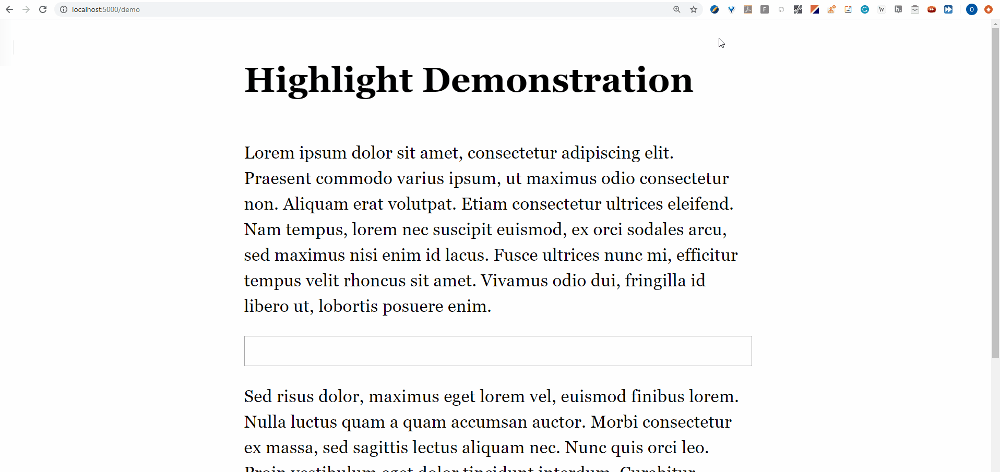

# Highlight
Highlight is a Chrome extension and a standalone tool for highlighting text on any website for highlighting text on any website, based on the [annotator.js](http://annotatorjs.org/) project.

 

# :wrench: Usage

Highlight can be used in 2 ways:  

## 1. Chrome extension  
Follow these steps to use Highlight as a Chrome extension:
   1. Download the repository and extract it  
   2. Go to Chrome's Extensions page, change it to Developer Mode  
   3. Click Load Unpacked to load the extracted folder.  
  
## 2. Standalone  
Use the following html tags:  
```html
<script src="libs/jquery-3.4.0/jquery.min.js"></script>
<script src="libs/jquery-ui-1.12.1/jquery-ui.min.js"></script>
<script src="libs/bootstrap-4.1.3/bootstrap.bundle.min.js"></script>
<script src="libs/tippy-6.2.3/popper-2.4.0/popper.min.js"></script>
<script src="libs/tippy-6.2.3/tippy.umd.min.js"></script>
<script src="js/standalone/dist/bundle.js"></script>
<link rel="stylesheet" type="text/css" href="css/highlight.css" />
```

To see it in action locally, run `demo\demo.html` using [`serve`](https://www.npmjs.com/package/serve):
1. Download the repository and extract it, then `cd` into it.
2. If you have npm, run:  

   ```
   npx serve  
   ```
   If you have yarn, run:  
   
   ```
   yarn global add serve
   serve
   ```
3. load `demo.html`.


# :rocket: Components
Highlight is comprised of 2 components: 

## 1. Highlighting 
Highlighting is done with a simple <kbd>ctrl</kbd>+<kbd>left mouse button</kbd> click.

## 2. Sidebar
### Cards
Any highlighted text is loaded into the sidebar into a designated card. You can interact with cards in the following ways:  
* Erase a card using the trash button. This will also, of course, remove the highlight itself. 
* Swap cards positions by dragging them.
* Click a card to automatically navigate into its respective highlight.
### Buttons
The following buttons are available:  
* **Copy**  
Copies the highlighted text into your clipboard 
* **Save** (currently supported only on the Chrome extension)   
Saves the highlights into Chrome storage, so that when you reload the page your saved highlights will reload .
* **Change position**  
Changes the sidebar position to the right or left side of the screen.

# :pencil: Implementation
## 1. Highlighting
The highlighting functionality is based on [annotator.js](http://annotatorjs.org/) implementation. Specifically, it uses functions from annotator.js's `highlighter.js` file, and its `xpath-range` module.
## 2. Sidebar
The sidebar is built using a [shadow DOM](https://developer.mozilla.org/en-US/docs/Web/Web_Components/Using_shadow_DOM). Using a shadow DOM enables the sidebar to load any css file without affecting the original DOM style. 
  * Note: this is why the `.higlight` class lives in its own css file, as it needs to be applied on the DOM itself.

# :hammer: Compilation
In case you're making changes to the javascript code, you'd need to compile using [Webpack](https://webpack.js.org/guides/installation/):
1. `cd` into `js/standalone`.
2. Run:  
  `webpack index.js` 

# :link: Similar Projects
- [hypothesis.io](https://github.com/hypothesis/h)
- [web-highlighter](https://github.com/alienzhou/web-highlighter)
- [rough notation](https://roughnotation.com/)
